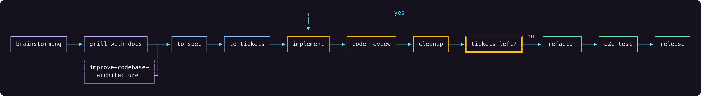

<p align="center">
  
</p>

# Loom

Loom sets up coding agents with shared skills, pinned tools, Pi packages, and project instructions. Its skills cover the path from an early idea to a tested pull request.

Use Loom with Pi (recommended), Claude Code, Codex, OpenCode, Cursor, Grok, or any agent that reads an Agent Skills folder.

## Install

Prefer to set things up yourself? Follow the [manual installation guide](INSTALL.md) for skills, tools, MCP servers, and agent-specific packages.

macOS or Linux:

```bash
curl -fsSL https://raw.githubusercontent.com/Yassimba/loom/main/install.sh | sh
```

Windows:

```powershell
powershell -NoProfile -ExecutionPolicy Bypass -Command "irm https://raw.githubusercontent.com/Yassimba/loom/main/install.ps1 | iex"
```

The installer adds [mise](https://mise.jdx.dev), Node.js, and the `loom` command. It then opens a menu for skills, tools, and Pi packages. Choose **Everything** or select only what you need. Loom shows the full plan before it changes your machine.

Native Windows is supported. Use WSL2 for Linux-only tools such as Herdr:

```powershell
wsl --install -d Ubuntu
```

Run the macOS or Linux install command inside Ubuntu.

## Start a project

1. Check your installation:

   ```bash
   loom status
   ```

2. Initialize a repository:

   ```bash
   cd your-project
   loom init
   ```

3. Start your coding agent in that repository. For Pi, run `pi`.
4. Give the agent a task and name the skill to use:

   ```text
   Use the implement skill to build the CSV export ticket.
   ```

`loom init` can create agent instructions, issue tracking, domain notes, coding standards, and editor links. When Serena or Codebase Memory is installed, it also registers the repository, adds detected Python and Rust language servers to Serena, creates a fast initial graph index, and adds a short code-intelligence section to `AGENTS.md`. Run `loom init --yes` to accept the detected defaults.

<details>
<summary>Optional setup</summary>

Interactive setup can enable ADHD-friendly Pi responses. It installs `i-have-adhd` and writes the Pi flag under `~/.pi/agent` or `PI_CODING_AGENT_DIR`. Run `/reload` in Pi after enabling it.

When Pi is installed or selected, Loom automatically installs [pi-loom](plugins/pi-loom/README.md) for its Loom header and startup update notice.

</details>

## Choose a workflow

Start with the skill that matches the current state of the work.

| You have | Start with |
| --- | --- |
| An early idea | [`brainstorming`](skills/brainstorming/SKILL.md) |
| Unresolved design decisions | [`grill-me`](skills/grill-me/SKILL.md) |
| A codebase that is hard to change | [`improve-codebase-architecture`](skills/improve-codebase-architecture/SKILL.md) |
| An agreed plan | [`to-spec`](skills/to-spec/SKILL.md) or [`to-tickets`](skills/to-tickets/SKILL.md) |
| A bug | [`diagnosing-bugs`](skills/diagnosing-bugs/SKILL.md) |
| Unnecessary complexity in a ticket | [`cleanup`](skills/cleanup/SKILL.md) |
| Completed tickets that need a structural pass | [`refactor`](skills/refactor/SKILL.md) |
| A completed change that needs a real-world check | [`e2e-test`](skills/e2e-test/SKILL.md) |

<p align="center">
  <a href="assets/loom-workflow.png">
    
  </a>
</p>

Repeat `implement -> code-review -> cleanup` for each ticket. When all tickets are complete, continue with `refactor -> e2e-test -> release`.

`implement` finds the next actionable ticket when you do not name one. It uses `ponytail`, `blueprint`, `tdd`, and `code-review` as needed. `release` runs the repository checks, asks before committing remaining changes, pushes the branch, and opens a pull or merge request.

Browse every skill in [`skills.sh.json`](skills.sh.json) or the `loom add` menu. If a skill is missing, install it with its dependencies:

```bash
loom add --skill implement --yes
```

## Manage Loom

### Add

Run `loom add` to browse, or select items directly:

```bash
loom add --skill tdd --yes
loom add --tool gh --tool gitleaks --yes
loom add --pi-package add-dir --yes
loom add --skill tdd --agent codex --yes
loom add --skill tdd --agent claude --scope project --yes
```

Loom installs skills in the global folders of detected agents by default. Use `--agent` to choose an agent or `--scope project` to install in the current repository. Add `--dry-run` to preview changes.

### Update

```bash
loom update
```

`loom update` refreshes only the items you selected. It does not add new capabilities.

### Remove

```bash
loom uninstall
loom uninstall --skill tdd --pi-package add-dir --yes
loom uninstall --all --yes
loom uninstall --dry-run --all
```

Loom keeps modified files by default. Interactive runs ask before deleting them; scripts require `--force-modified`.

Uninstall removes Loom's tool selection, not shared runtimes. It preserves mise,
runtime binaries, PATH entries, and shell activation.

## Pi packages

Install Pi packages through `loom add`, or install one directly:

```bash
pi install npm:@yassimba/pi-fast
pi install npm:@yassimba/pi-guardrails
pi install npm:@yassimba/pi-skill-autocomplete
pi install npm:@yassimba/pi-loom-mermaid
```

| Package | What it adds |
| --- | --- |
| [`pi-fast`](plugins/pi-fast/) | `/fast` priority requests for OpenAI, Codex, and xAI |
| [`pi-guardrails`](plugins/pi-guardrails/) | Safety checks plus `/add-dir` trusted workspace roots |
| [`skill-autocomplete`](plugins/skill-autocomplete/) | `$` skill completion in the editor |
| [`pi-loom-mermaid`](plugins/pi-loom-mermaid/) | Colored Mermaid diagrams with cleaner routing |

### Mermaid that stays readable in Pi

`pi-loom-mermaid` adds class colors, visible hops where lines cross, and shorter routes around complex graphs. The same flowchart shows the difference:

| Pi built-in | pi-loom-mermaid |
| :---: | :---: |
| [](assets/mermaid-pi-builtin.png) | [](assets/mermaid-pi-loom.png) |
| One gray style and stacked outer routes | Class colors, crossing hops, and shorter routes |

Open either image for the full-size comparison. See the [pi-loom-mermaid guide](plugins/pi-loom-mermaid/README.md) for setup, usage, and more examples.

Loom installs Pi's standalone skills in `.agents/skills`. Start Pi from the project root so its `.pi/settings.json` applies. [`manifest/pi-packages.json`](manifest/pi-packages.json) lists the current package names and versions.

## MCP servers

MCP connects Pi to extra tools. Loom offers three reviewed servers:

| Server | What it adds |
| --- | --- |
| [Serena](https://github.com/oraios/serena) | Local LSP-backed symbol navigation and editing |
| [Codebase Memory](https://github.com/DeusData/codebase-memory-mcp) | Local repository graph and change-impact analysis |
| [Context7](https://github.com/upstash/context7) | Hosted library documentation and code examples |

```bash
loom add --mcp-server serena --mcp-server codebase-memory-mcp --agent pi
```

Loom installs the selected local binaries, shared Pi MCP adapter, and a non-blocking routing extension that nudges agents toward the code-intelligence tools after repeated native searches. Add `--scope project` for project-only server configuration; binaries, Pi, and packages remain machine-wide. All tools use gateway-only exposure. Loom keeps Serena’s dashboard available without opening it, disables its overlapping memory surface, and restricts Codebase Memory to its read-only analysis profile. Run `loom init` in each repository, then restart Pi and open `/mcp` to check the connections.

Context7 queries leave the machine. Serena and Codebase Memory run as local stdio servers.

## Wiki vaults

Run `loom wiki` to create a Vault or adopt an existing Obsidian directory. Each Vault gets a named QMD search index and project-local wiki skills.

```bash
loom wiki
loom wiki status
loom wiki repair /path/to/Vault
loom wiki unregister /path/to/Vault
```

The index is a snapshot, so run `repair` after editing notes. `unregister` removes Loom's machine record without deleting notes. If you enable Confluence export, CME stores its credentials as owner-only plaintext.

## Install without Loom

Use the Vercel skills CLI to install Loom skills directly into OpenCode, Claude Code, Codex, Cursor, or another supported agent:

```bash
npx skills add Yassimba/loom
```

The command lets you choose the agent, skills, and global or project scope. For a non-interactive OpenCode install:

```bash
# All public Loom skills, for your user account
npx skills add Yassimba/loom --agent opencode --skill '*' --global --yes

# One skill, in the current project
npx skills add Yassimba/loom --agent opencode --skill tdd --yes
```

Use `--agent '*'` to install for every detected agent. Run `npx skills update --global` to update global installs.

Claude Code users can install Loom as a plugin instead:

```text
/plugin marketplace add Yassimba/loom
/plugin install loom@loom
```

These methods install skills, not Loom's pinned command-line tools or Pi packages. Follow the [manual installation guide](INSTALL.md) to add command-line tools, MCP servers, and agent-specific packages.

## Repository layout

| Path | Contents |
| --- | --- |
| `skills/<name>/SKILL.md` | Reviewed public skills |
| `plugins/<name>/` | Pi packages |
| `manifest/` | Pinned tools and setup metadata |
| `cli/loom/` | Rust CLI |
| `drafts/` | Unreviewed, unpublished skills |
| `personal/` | Machine-specific skills that are never published |

## Contributing

1. Clone the repository and run `npm install`.
2. Make the change. Keep unreviewed skills in `drafts/` and machine-specific skills in `personal/`.
3. Run `npm run catalog:generate` after changing a public skill or package entry.
4. Run `npm run check`. After code changes, also run `npm run audit`.
5. Use Conventional Commits. Release automation owns versions and tags.

Run `npm run check:js` or `npm run check:rust` for a narrower check. See [AGENTS.md](AGENTS.md) for sync rules and repository conventions.

## Credits

Skills in this repository draw from work by [Matt Pocock](https://github.com/mattpocock/skills), [DataDog/pup](https://github.com/DataDog/pup), [pbakaus/impeccable](https://github.com/pbakaus/impeccable), [ayghri/i-have-adhd](https://github.com/ayghri/i-have-adhd), [DietrichGebert/ponytail](https://github.com/DietrichGebert/ponytail), and [cathrynlavery/diagram-design](https://github.com/cathrynlavery/diagram-design). Their licenses and pinned source versions are recorded beside the imported skills.

Pi subagents, web access, and rewind draw from [nicobailon's Pi packages](https://github.com/nicobailon). Anthropic sign-in draws from [gotgenes/pi-anthropic-auth](https://github.com/gotgenes/pi-anthropic-auth). `pi-loom-mermaid` draws from `pi-lovely-mermaid`.

## License

[MIT](LICENSE)
