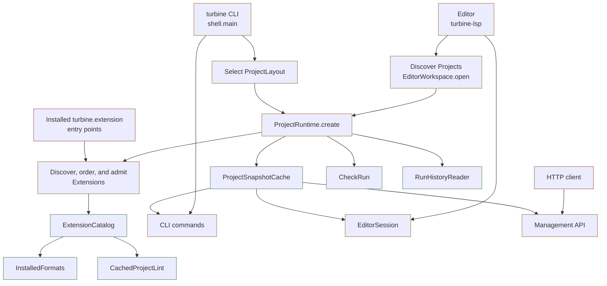
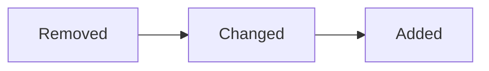

<p align="center">
  
</p>

# Loom

Loom installs the skills, tools, Pi packages, and project files I use for agentic engineering, with pinned versions.

Use it with Pi (recommended), Claude Code, Codex, OpenCode, Cursor, Grok, or any agent that reads an Agent Skills folder. The optional [pi-loom](plugins/pi-loom/README.md) extension adds a Loom header and a startup update notice in Pi.

## Install

macOS or Linux:

```bash
curl -fsSL https://raw.githubusercontent.com/Yassimba/loom/main/install.sh | sh
```

Windows:

```powershell
powershell -NoProfile -ExecutionPolicy Bypass -Command "irm https://raw.githubusercontent.com/Yassimba/loom/main/install.ps1 | iex"
```

The installer adds [mise](https://mise.jdx.dev), Node.js, and the `loom` command, then opens the setup menu. Pick **Everything** for the full set, or choose skill groups, tools, Pi packages, and individual items. Review shows the plan before anything is installed.

Interactive `loom setup` also asks whether to always enable ADHD-friendly Pi responses. **Yes** installs `i-have-adhd` and writes Pi's `.i-have-adhd-always` flag in `~/.pi/agent` (or `PI_CODING_AGENT_DIR`). **No** leaves settings alone. Selecting Everything does not turn this on by itself. Run `/reload` in Pi afterwards. An existing session that already chose off still wins until you run `/i-have-adhd on` there.

Native Windows works. Use WSL2 if you also want Linux-only tools such as Herdr:

```powershell
wsl --install -d Ubuntu
```

Then run the Unix install command inside Ubuntu.

## Check and start a project

```bash
loom status
```

That lists what is installed and any step that still needs you.

Once per repository:

```bash
cd your-project
loom init
```

`loom init` can create `AGENTS.md` and `CLAUDE.md`, local issue tracking (Markdown or [Beads](https://github.com/Dicklesworthstone/beads_rust)), domain notes, coding standards, editor links, and a Gortex graph for Pi and Zed when Gortex is installed. `loom init --yes` accepts the detected defaults.

Diagrams: choose **Polished** (atlas SVG/HTML) or **Economical** (Mermaid from atlas references) in setup. That default lives in `~/.config/loom/diagrams.json`. `loom init` can override it for one project in `ai-docs/agents/diagrams.json`, or pass `--diagrams economical` (`polished` and `inherit` also work). `loom init --yes` keeps an existing project choice. A request such as "use polished diagrams for this plan" overrides both for that task.

## The main workflow

You do not need every step. Start at the first one that helps.

```text
brainstorming
    ↓
grill-with-docs
    ↓
to-spec → to-tickets
                ↓
            implement
                ↓
            e2e-test
                ↓
             release
```

**brainstorming** when the idea is still loose. The agent asks short questions and writes a small idea brief. Skip it when the task is already clear.

**grill-with-docs** when the goal is clear but the rules are not. One question at a time, recorded in domain notes. For work too large for one session, use `wayfinder` instead: it puts open questions on the issue tracker and works them one by one.

**to-spec** turns the conversation into a spec. **to-tickets** splits an approved spec into small pieces, each a working path through the product, with blockers named. With Beads, `ticket-overview` shows the ready work without changing it, and `implement` can take the next actionable ticket.

**implement** builds one ticket: `ponytail` looks for the smallest change that works, `blueprint` waits for design approval, `tdd` writes a failing test first when a useful test fits, `code-review` checks the change against the spec and the repo rules, `commit` writes one Conventional Commits commit. You can run any of those skills alone.

**e2e-test** starts the real app and uses it through its CLI, API, or web page. It saves output and screenshots, then checks stored data.

**release** runs lint, type checks, and tests, then commits remaining work, pushes, and opens a pull or merge request. Unclear test failures go through `diagnosing-bugs` before more code changes.

## Terminal Mermaid in Pi

[`pi-loom-mermaid`](plugins/pi-loom-mermaid/README.md) draws Mermaid blocks in the terminal with colored borders and interior routing. It also tells the agent it can answer in diagrams when that is clearer than prose. Install it from setup, or:

```bash
pi install npm:@yassimba/pi-loom-mermaid
```

Set `markdown.mermaid` to `off` in `~/.pi/agent/settings.json` so Pi hands the original source to this renderer, then `/reload`.

Same diagram, three renderers:

Pi's built-in Mermaid. One gray box style. Edges share long outer rails and stack.

<p align="center">
  
</p>

pi-lovely-mermaid. Colored borders. Edges still take long parallel paths around the right side.

<p align="center">
  
</p>

pi-loom-mermaid. The same colors, plus hops where edges cross and fewer stacked rails.

<p align="center">
  
</p>

GitHub draws this block with its own Mermaid. Paste the same source into Pi to compare the built-in renderer with this package.



Stress cases: complex diagrams rendered by both engines.

**State — Pi built-in**

<p align="center">
  
</p>

**State — pi-loom-mermaid**

<p align="center">
  
</p>

**ER — Pi built-in**

<p align="center">
  
</p>

**ER — pi-loom-mermaid**

<p align="center">
  
</p>

**Sequence — Pi built-in**

<p align="center">
  
</p>

**Sequence — pi-loom-mermaid**

<p align="center">
  
</p>

**Dense class graph — Pi built-in**

<p align="center">
  
</p>

**Dense class graph — pi-loom-mermaid**

<p align="center">
  
</p>

**Dense flowchart — Pi built-in**

<p align="center">
  
</p>

**Dense flowchart — pi-loom-mermaid**

<p align="center">
  
</p>

Mark diff nodes with the built-in `red`, `orange`, and `green` classes (border only; fill and text stay on Pi's theme):



Standard Mermaid `classDef` can add other colors. Diagrams wider than the terminal stay as source.

## Other useful skills

| When you need to...                                       | Use...                                                                                                         |
| --------------------------------------------------------- | -------------------------------------------------------------------------------------------------------------- |
| Find the cause of a bug before fixing it                  | [`diagnosing-bugs`](skills/diagnosing-bugs/SKILL.md)                                                           |
| Remove code or make it simpler                            | [`cleanup`](skills/cleanup/SKILL.md) or [`ponytail`](skills/ponytail/SKILL.md)                                 |
| Understand how a feature works                            | [`explain-code-flow`](skills/explain-code-flow/SKILL.md)                                                       |
| Understand a whole multi-repo product in one diagram page | [`system-atlas`](skills/system-atlas/SKILL.md)                                                                 |
| Walk through a large change in the browser                | [`changeset-walkthrough`](skills/changeset-walkthrough/SKILL.md)                                               |
| Review a plan or diff with comments                       | [`plannotator`](skills/plannotator/SKILL.md)                                                                   |
| Design or improve a web interface                         | [`impeccable`](skills/impeccable/SKILL.md)                                                                     |
| Draw a diagram                                            | [`diagram-design`](skills/diagram-design/SKILL.md) or [`mermaid-skill`](skills/mermaid-skill/SKILL.md)         |
| Build browser slides                                      | [`frontend-slides`](skills/frontend-slides/SKILL.md)                                                           |
| Write a README or guide                                   | [`write-readme`](skills/write-readme/SKILL.md) or [`write-documentation`](skills/write-documentation/SKILL.md) |
| Make prose shorter and clearer                            | [`write-simply`](skills/write-simply/SKILL.md)                                                                 |
| Work with Datadog                                         | the `datadog` skill for logs, APM, monitors, docs, and live debugging                                          |

The full list is in [`skills.sh.json`](skills.sh.json) and in the `loom add` menu.

## Add, update, remove

```bash
loom add
loom add --skill tdd --yes
loom add --tool gh --tool gitleaks --yes
loom add --pi-package add-dir --yes
loom add --skill tdd --dry-run
loom update
```

`loom update` refreshes only what you already chose, and only after this repository publishes new pins. It also updates registered project skill folders and Wiki Vaults without adding new capabilities.

```bash
loom uninstall
loom uninstall --all --yes
loom uninstall --skill tdd --pi-package add-dir --yes
loom uninstall --dry-run --all
```

Modified files stay by default. Interactive runs ask again before deleting them; scripts need `--force-modified`. Project resources are limited to the current repository.

By default Loom finds installed agents and writes skills to their global folders. `--agent` names an agent. `--scope project` keeps the skill in the current repository. When one skill calls another, Loom installs that skill in the same place.

```bash
loom add --skill tdd --agent codex --yes
loom add --skill tdd --agent claude --scope project --yes
```

## Wiki vaults

```bash
loom wiki
```

Create makes a new Vault. Adopt needs an existing directory with `.obsidian/`. Loom shows the `claude-obsidian` paths it will change and applies only the reviewed plan hash. Obsidian itself is optional; Loom can open the download page and does not run Homebrew, Winget, Snap, or Flatpak.

Each Vault gets a named QMD index and embeddings. Setup prints the query command. This is a snapshot, not a file watcher: run repair after you edit notes. Confluence credentials, when you choose that option, go to CME's config as owner-only plaintext. `--yes` and `loom update` never prompt for them.

Wiki skills exist only inside the Vault. Unregister removes Loom's machine record and never deletes notes. A missing Vault is reported and never recreated.

```bash
cd /path/to/Vault && pi
loom wiki status
loom wiki repair /path/to/Vault
loom wiki unregister /path/to/Vault
```

## Install without Loom

```bash
npx skills add Yassimba/loom
```

Claude Code:

```text
/plugin marketplace add Yassimba/loom
/plugin install loom@loom
```

Pi packages from this repo:

```bash
pi install npm:@yassimba/pi-fast
pi install npm:@yassimba/pi-add-dir
pi install npm:@yassimba/pi-skill-autocomplete
pi install npm:@yassimba/pi-loom-mermaid
```

- [`pi-fast`](plugins/pi-fast/) adds `/fast` for priority requests on OpenAI, Codex, and xAI.
- [`add-dir`](plugins/pi-add-dir/) adds another directory and its root instructions to the current Pi session.
- [`skill-autocomplete`](plugins/skill-autocomplete/) adds `$` skill completion in the editor.
- [`pi-loom-mermaid`](plugins/pi-loom-mermaid/) draws colored Mermaid diagrams in the terminal.

Loom installs Pi's standalone skills in `.agents/skills`. It does not create a second copy under `.pi/skills`. Start Pi from the selected project root so project `.pi/settings.json` applies. See [`manifest/pi-packages.json`](manifest/pi-packages.json) for the current names and versions.

## What this repository holds

- `skills/<name>/SKILL.md`: reviewed public skills
- `plugins/<name>/`: Pi packages built here
- `manifest/loom.toml`: pinned tools offered by setup
- `manifest/tools.json`: names and help text for those tools
- `cli/loom/`: the Rust setup command
- `cli/loom/setup-catalog.json`: the generated list built into the command
- `.claude-plugin/`: the Claude Code marketplace package
- `drafts/`: skills that are not reviewed or published
- `personal/`: machine-specific skills that are never published
- `assets/`: logo and README images

## Contributing

```bash
npm install
npm run check
npm run audit
```

Rust command:

```bash
cargo fmt --manifest-path cli/loom/Cargo.toml -- --check
cargo clippy --manifest-path cli/loom/Cargo.toml --all-targets -- -D warnings
cargo test --manifest-path cli/loom/Cargo.toml
```

After a public skill or package entry change:

```bash
npm run catalog:generate
```

Local Pi package work:

```bash
scripts/sync-pi-extensions.sh status
scripts/sync-pi-extensions.sh link
```

## Credits

- Several coding skills are adapted from [Matt Pocock's skills](https://github.com/mattpocock/skills).
- [`research`](skills/research/SKILL.md) is adapted from [Matt Pocock's research skill](https://github.com/mattpocock/skills).
- The `datadog` skill is adapted from [DataDog/pup](https://github.com/DataDog/pup) v1.10.5 under Apache 2.0.
- [`impeccable`](skills/impeccable/SKILL.md) is adapted from [pbakaus/impeccable](https://github.com/pbakaus/impeccable) v4.1.2 under Apache 2.0.
- [`i-have-adhd`](skills/i-have-adhd/SKILL.md) is adapted from [ayghri/i-have-adhd](https://github.com/ayghri/i-have-adhd) v0.2.0 at `cbe69fb` under MIT.
- [`ponytail`](skills/ponytail/SKILL.md) is adapted from [DietrichGebert/ponytail](https://github.com/DietrichGebert/ponytail) v4.9.0 under MIT.
- [`diagram-design`](skills/diagram-design/SKILL.md) is adapted from [cathrynlavery/diagram-design](https://github.com/cathrynlavery/diagram-design) v2.6.12 at `4451ead` under MIT.
- Pi subagents, web access, and rewind are adapted from [nicobailon's Pi packages](https://github.com/nicobailon).
- Anthropic sign-in is adapted from [gotgenes/pi-anthropic-auth](https://github.com/gotgenes/pi-anthropic-auth).
- pi-loom-mermaid is adapted from pi-lovely-mermaid.

## License

[MIT](LICENSE)
