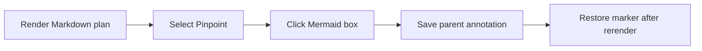
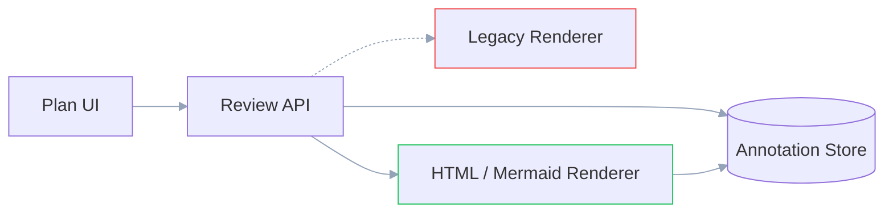
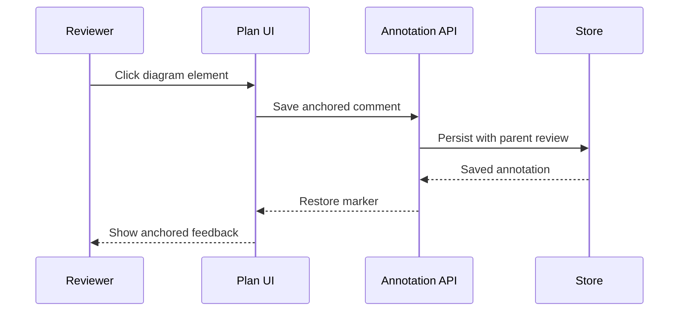
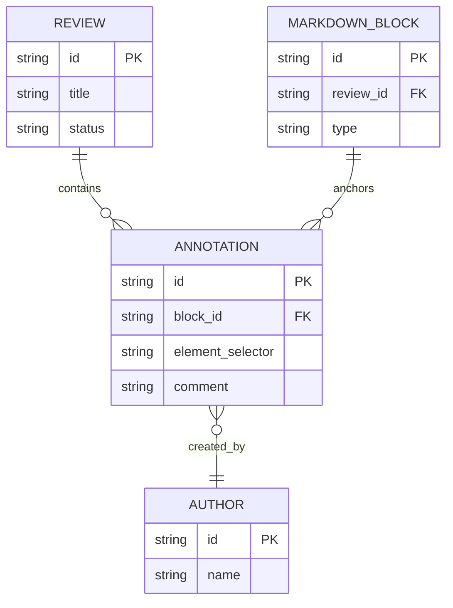
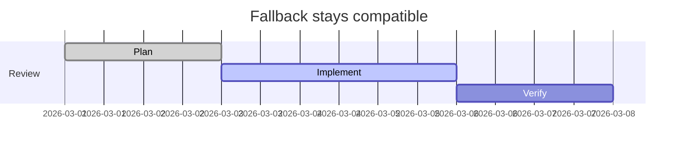

# Mermaid Node Annotations

## Context

Markdown plans currently treat a Mermaid diagram as one annotation target. The intended outcome is to let reviewers attach comments to individual Mermaid boxes while keeping comments in the parent plan review.

## Complex diagram testbed

### Architecture diff

Green borders are added. Red borders are removed. Connectors stay neutral; the removed path is dashed.

### Review sequence

### Annotation entities

### Official Mermaid fallback

## Approach

Extend the existing Markdown `Viewer` and `MermaidBlock` path. Identify rendered `g.node[id]` elements, store the shared `HtmlElementAnchor` shape with the Markdown block ID, and route creation through the existing comment composer and parent annotation callback.

Keep Mermaid's current renderer and controls. Mermaid boxes are object targets rather than selectable document text, so clicking a box opens its comment composer in both **Select** and **Pinpoint** input methods. This removes the mode switch while preserving the global mode semantics for prose. Pointer movement beyond the existing drag threshold remains pan behavior, and read-only/diff/active-composer guards still disable annotation.

Fullscreen currently exposes a stacking bug: `MermaidBlock` renders its expanded portal at `z-[9999]`, while `CommentPopover` renders at `z-[100]`. The click creates the composer, but the fullscreen diagram covers it. Keep the fullscreen layer unchanged and raise the existing comment-popover layers above it so the same composer stays visible in both inline and expanded views.

## Files to modify

- `/Users/yassin/projects/personal/plannotator/packages/ui/components/mermaidSvg.ts`
- `/Users/yassin/projects/personal/plannotator/packages/ui/components/MermaidBlock.tsx`
- `/Users/yassin/projects/personal/plannotator/packages/ui/components/Viewer.tsx`
- `/Users/yassin/projects/personal/plannotator/packages/ui/components/Viewer.mermaidAnnotations.test.tsx`
- `/Users/yassin/projects/personal/plannotator/packages/ui/components/CommentPopover.tsx`

## Reuse

- `HtmlElementAnchor` from `packages/ui/types.ts`
- Existing `CommentPopover` flow in `packages/ui/components/Viewer.tsx`
- Existing Mermaid rendering, zoom, pan, source, and expanded modes in `packages/ui/components/MermaidBlock.tsx`
- Existing parent `Annotation` persistence and selection callbacks

## Steps

- [ ] Add pure helpers to find, build, and resolve stable Mermaid node anchors.
- [ ] Add delegated node click handling in both input methods, pan suppression, marker restoration, and selected-node styling to `MermaidBlock`.
- [ ] Route Mermaid node comments through `Viewer` as ordinary parent annotations.
- [ ] Keep Mermaid anchors out of generic text-highlight restoration.
- [ ] Add focused tests for creation, rerender restoration, existing-note selection, stale anchors, and panning.
- [ ] Keep the comment composer above Mermaid's `z-[9999]` fullscreen portal and cover expanded-view annotation creation.

## Verification

- Run focused Mermaid, diagram-runtime, and Viewer regression tests.
- Run the repository-wide TypeScript check and `git diff --check`.
- Build and install the Pi extension, then restart Pi before testing so the active process does not reuse its previously loaded extension/UI bundle.
- Open this plan in the default **Select** input method, click individual boxes in the diagram, and save comments without switching modes.
- Repeat in **Pinpoint**, then toggle source/diagram, expand, zoom, and confirm markers remain attached to the correct boxes.
- While expanded, click a box and confirm the composer is visible above the diagram, accepts a comment, and restores the marker after closing and reopening expanded view.
