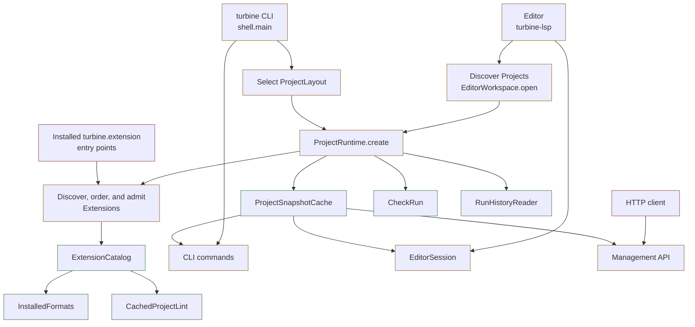

# pi-loom-mermaid

Show diagrams directly in Pi, with colored boxes, a clearer layout, and connecting lines that are easier to follow.

This extension draws diagrams written in Mermaid, a text format for describing boxes, arrows, and other shapes. It also asks the agent to use diagrams when they explain something more clearly than text.

## Install

Requires Pi and Node.js 22.6 or newer.

1. Install the package:

   ```bash
   pi install npm:@yassimba/pi-loom-mermaid
   ```

2. Set `markdown.mermaid` to `"off"` in `~/.pi/agent/settings.json`. Merge this into your existing settings; do not replace the file:

   ```json
   {
     "markdown": {
       "mermaid": "off"
     }
   }
   ```

   This turns off Pi’s own diagram drawing so this extension can draw instead. If you have another Mermaid extension installed, disable it with `pi config`.

3. Run `/reload` in Pi.

## Usage

Ask Pi: “Explain this code with a Mermaid diagram.” Pi draws the diagram in the conversation.

You can also paste the example below. Keep the opening line of three backticks followed by `mermaid`, and the closing line of three backticks.

To show changes, add `:::red` after a box for removed code, `:::orange` for changed code, or `:::green` for added code. These labels give boxes muted colored borders. Text and backgrounds keep your Pi theme’s colors. The `classDef` lines in the example set custom border colors.

If a diagram is too wide, Pi shows its code instead. Widen the terminal or ask Pi to split it into smaller diagrams.

## Plannotator document export

`loom-mermaid-render` requires Bun on `PATH` (also required by Herdr Annotate).
The CLI uses Bun because Node cannot strip TypeScript inside installed `node_modules`;
the Pi extension runtime is unchanged. It reads Markdown on stdin and writes
pre-rendered diagrams in `loom-mermaid` fences. Set `LOOM_MERMAID_WIDTH` to change the default 100-column limit.
This format requires the Loom-patched Plannotator TUI: it hides the fences and maps
SGR colors, bold, and dim into terminal spans. Hyperlinks are omitted; unsupported
or oversized diagrams keep their original Mermaid source. Ordinary Markdown viewers
do not understand this colored interchange format.

## The same diagram in Pi and GitHub

All three views below use the same Mermaid code.

### Pi built-in

Gray boxes. Connecting lines take long paths around the outside.

<p align="center">
  
</p>

### pi-loom-mermaid

Colored boxes and shorter connecting lines. Small bends mark where lines cross.

<p align="center">
  
</p>

### GitHub built-in

GitHub draws the code below as a diagram. Copy the code into Pi to compare how it looks.



## Update or remove

Update the package, then run `/reload`:

```bash
pi update npm:@yassimba/pi-loom-mermaid
```

To uninstall:

```bash
pi remove npm:@yassimba/pi-loom-mermaid
```

Delete the `"mermaid": "off"` setting you added to restore Pi’s own diagram drawing, then run `/reload`.

## Contributing

From the [Loom repository](https://github.com/Yassimba/loom) root, run `npm ci`, `npm run check`, and `npm run audit` before opening a pull request.

## License

[MIT](LICENSE). Adapted from pi-lovely-mermaid.
