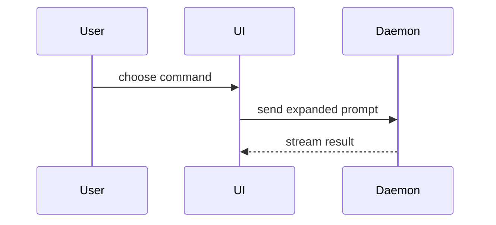

# Show Me

Help the user understand the current topic of conversation visually. Skip the preamble and keep prose brief. Pick the smallest view that makes the key point clear.

Invoke the `write-simply` skill (via the Skill tool) — captions follow its register.

- Show logic or an algorithm as pseudocode:

```text
on(save)
  if content is unchanged
    return cached result
  write new content
  return fresh result
```

- Show runtime control flow as a call tree:

```text
submit_form
  create_session
    persist_prompt
    launch_agent
  navigate_to_session
```

- Show UI structure as a component tree, including state and module boundaries that matter:

```python
SessionPage  # apps/example/routes/session.py
  get_session_events()
  SessionToolbar
    RunSkillButton  # packages/ui
```

- Show file responsibility or a broad refactor as a shallow file tree:

```text
src/
├── commands/       # parses user actions
├── sessions/       # owns session state
└── transport/      # sends API requests
```

- Show component interaction, control flow, or data flow with Mermaid:



- Use `diff` when the point is what changes and the surrounding shape already exists. Match the diff shape to the topic.

For a component change:

```diff
 SessionPage
   get_session_events()
   SessionToolbar
+    RunSkillButton
   SessionTimeline
+    SkillResultCard
```

For a file-layout change:

```diff
 src/
 ├── commands/
+│   └── show_me.py       # expands the slash command
 ├── sessions/
-└── transport.py
+└── transport/
+    ├── client.py
+    └── stream.py
```

For a call-tree or call-stack change:

```diff
 submit_form
   create_session
     persist_prompt
+    expand_skill_mention
     launch_agent
-  navigate_to_session
+  navigate_to_session
+    subscribe_to_events
```

For a state or control-flow change:

```diff
 on(save)
-  write content
+  if content is unchanged
+    return cached result
+  write new content
+  invalidate cache
```

- Show the whole block when most of it is new, when omitted context would hide ownership or order, or when the user needs a copyable target shape:

```python
def expand_skill(command: str) -> str:
    skill_name = command[1:]
    return f"use the {skill_name} skill"
```

- For a visual UI, layout, state comparison, or concept too dense for Mermaid, write one focused HTML file — a diagram, an infographic, or a short slide deck, whichever fits the point. Match the product's colors, type, spacing, and components; use real labels and data; support desktop and mobile. Then open it for the user:

```
Bash(open path/to/show-me-{description}.html)
```

### guidance

Place each visual next to the short text it supports. Keep only the calls, files, props, states, and boundaries needed to answer the user's current question or the options to resolve the current discussion point.

You may use one of these, you may use several, it is unlikely you will use all of them. Use your judgement and don't overwhelm the user.
