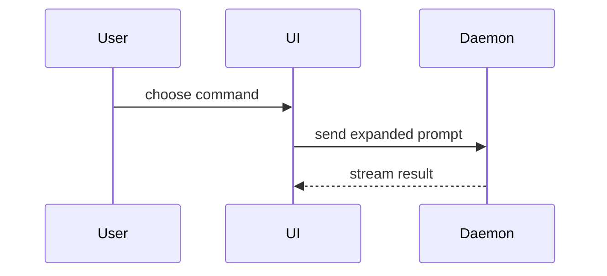

# Show Me

1. Name the point the reader needs in one line.
2. Pick the smallest view that makes it clear, from the table. Place the view next to that line; captions follow the `writing-clearly-and-concisely` register (invoke it via the Skill tool).

| The point is…                                            | View                                      |
| -------------------------------------------------------- | ----------------------------------------- |
| Logic or an algorithm                                    | pseudocode                                |
| Runtime control flow                                     | call tree                                 |
| UI structure, with the state and module boundaries       | component tree                            |
| File responsibility or a broad refactor                  | shallow file tree                         |
| What changes, when the surrounding shape exists          | the same shape in a `diff` fence          |
| Component interaction or data flow                       | Mermaid sequence or flowchart             |
| A call graph with the data on every hop                  | lineage — read `references/lineage.md`    |
| A visual UI, layout, or state comparison                 | one HTML file — read `references/html.md` |
| Most of it is new, or the reader needs a copyable target | the whole block                           |

Keep only the calls, files, props, states, and boundaries that answer the current question.

## Shapes

Pseudocode:

```text
on(save)
  if content is unchanged
    return cached result
  write new content
  return fresh result
```

Call tree:

```text
submit_form
  create_session
    persist_prompt
    launch_agent
  navigate_to_session
```

Component tree, with the boundaries that matter:

```python
SessionPage  # apps/example/routes/session.py
  get_session_events()
  SessionToolbar
    RunSkillButton  # packages/ui
```

File tree:

```text
src/
├── commands/       # parses user actions
├── sessions/       # owns session state
└── transport/      # sends API requests
```

Diff — any shape above, `+`/`-` on the lines that change, unchanged lines as context:

```diff
 submit_form
   create_session
     persist_prompt
+    expand_skill_mention
     launch_agent
   navigate_to_session
+    subscribe_to_events
```

Mermaid:



## Done means

The reader can answer their question from the view and its one-line caption, without the surrounding prose.
